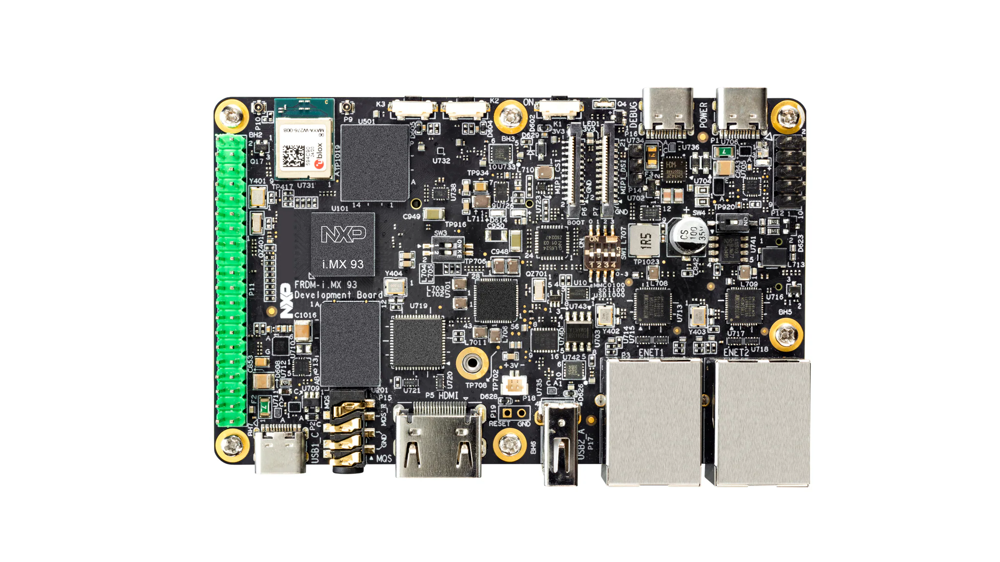
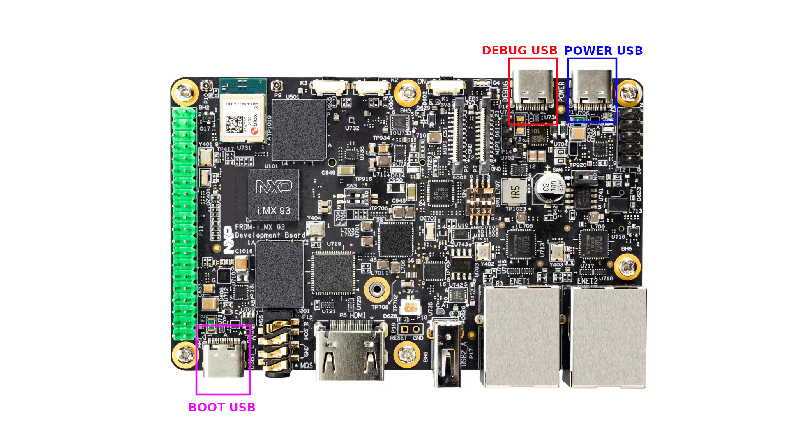

.. _development_board:

The development board
=====================

`FRDM-IMX93`_ is a small and compact board developed by NXP, which integrates
the `i.MX93`_ chip and offers the following hardware features [#]_:

* 2 x ARM Cortex-A55
* 1 x ARM Cortex-M33
* 3 x USB-C
* 32GB eMMC
* 2GB of RAM
* 40-pin expansion header

A top view of the board is shown in :numref:`frdm-imx93-top-view`.

.. _frdm-imx93-top-view:

   Top view of the FRDM-IMX93 board [#]_

The USB-C ports
---------------

As previously mentioned, the development board is equiped with **three** USB-C
ports, which are highlighted in :numref:`frdm-imx93-usb-c-ports`.

.. _frdm-imx93-usb-c-ports:

   FRDM-IMX93 USB-C ports

Each of the three USB-C ports serves a different purpose, as described below:

1. **BOOT USB**: used to load the images required during the board's boot process.
2. **POWER USB**: used to power the board.
3. **DEBUG USB**: used for debugging the board and communicating with the bootloader.

.. [#] List is not exhaustive.
       For a more comprehensive list of features please check out:
       https://www.nxp.com/design/design-center/development-boards-and-designs/frdm-i-mx-93-development-board:FRDM-IMX93

.. [#] Source: https://www.nxp.com/design/design-center/development-boards-and-designs/FRDM-IMX93

.. _i.MX93: https://www.nxp.com/products/processors-and-microcontrollers/arm-processors/i-mx-applications-processors/i-mx-9-processors/i-mx-93-applications-processor-family-arm-cortex-a55-ml-acceleration-power-efficient-mpu:i.MX93

.. _FRDM-IMX93: https://www.nxp.com/design/design-center/development-boards-and-designs/frdm-i-mx-93-development-board:FRDM-IMX93
